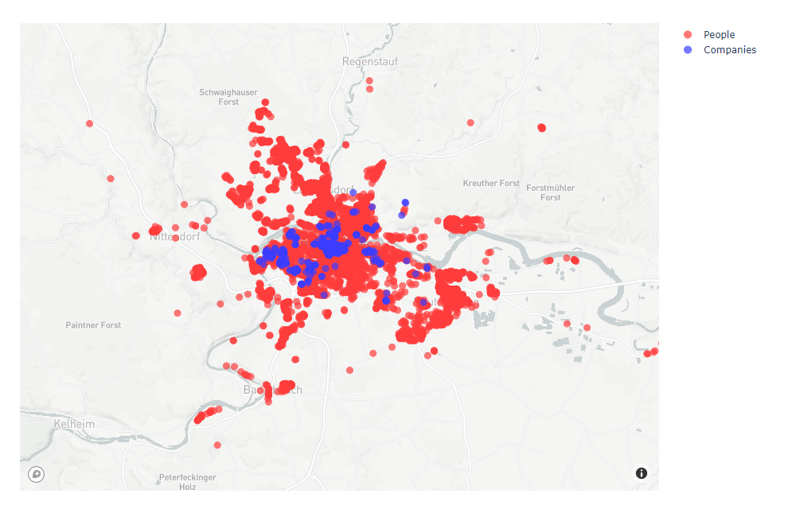

<p align="center">
    
</p>

# Hackaburg 2023 Challenge: WORK SMARTER & SUSTAINABLE

This repository contains data of fake people and companies you can use for your ideas and some sample code to generate your own data.


*The map shows the data from `data/people-with-addresses.csv` and `data/ratisbona-companies.csv`*

## Overview

Please come up with your own ideas on how to make work travel more sustainable. How can we reduce or prevent unnecessary travel. Optimize the routes or show alternative modes of travel. This sample data should make starting easier. Feel free to use more datasources, or make data up if necessary. It is not important to have a working implementation. Good ideas count!

### Some ideas

* Imagine a desk booking system where you are able to retrieve data from and see who is when in the office. Could this data be used to make work travel more sustainable?
* Maybe there is an API for traffic data that we can use? Weather information? Public transport?
* A company might have a parking lot with usage statistics. Maybe this data could be interessting.
* Maybe we can make this fun by adding competition or gamification

The data is structured as follows:

```
Hackaburg2023/
├─ data/
│  ├─ ratisbona-companies.csv   # A list of around 750 companies located in ratisbona
|  ├─ people-with-addresses.csv # A list of 10000 fake people with real addresses
|  ├─ people-with-companies.csv # A list of 10000 fake people with a relation to the company list
│  ├─ people.csv                # A list of 10000 fake people
│  ├─ ratisbona-addresses.csv   # A list of all addresses within 93000 > postal_code < 93300
├─ DemoData.ipynb               # A jupyter notebook to generate your own test data
```

With this data you have 10000 people distributed around Ratisbona and around 750 companies that are located in Ratisbona. Everything else is up to your imagination. Feel free to add more data, new data, real data.

## How to generate your own data

You can use the provided Jupyter notebook to see how the data was generated and generate your own data.

### Quickstart

If you use VSCode, you can open the folder and use the [remote container](https://code.visualstudio.com/docs/devcontainers/containers) feature to start this folder within the provided development container.

After the container has startet you should be able to run the scripts inside the Jupyter Notebook.
